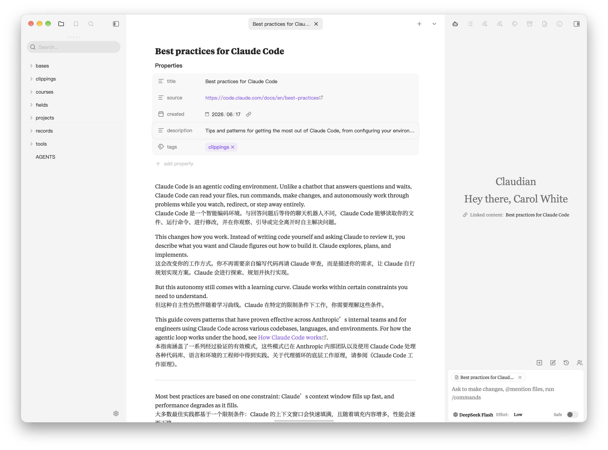
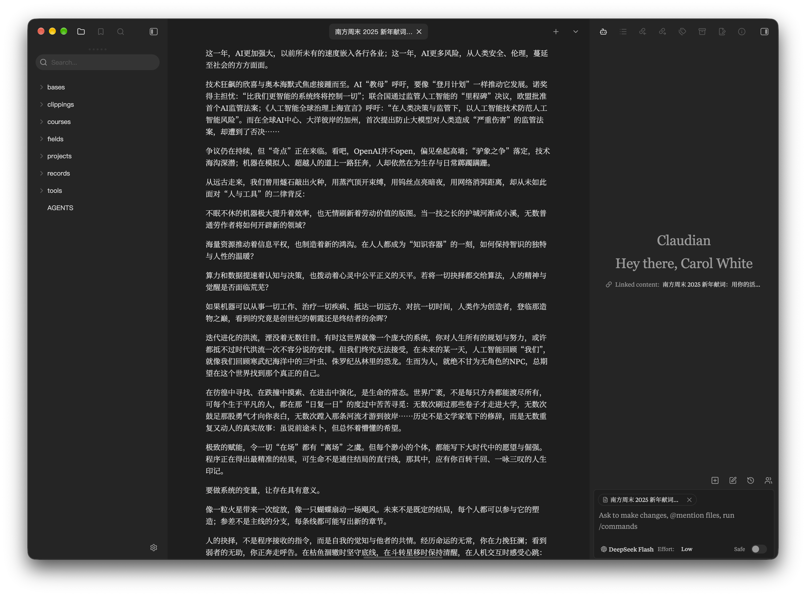

<div align="center">

# Obsidian MacOS

### An Obsidian theme that matches the native Mac style

Built on [Baseline](https://github.com/aaaaalexis/obsidian-baseline)

**English** · [简体中文](README-zh.md)





</div>

## Overview

This theme brings the design language of native macOS apps into Obsidian: the left and right sidebars are no longer cards floating over the window, but instead stick all the way to the window edges like Finder and Notes, filling the area below the title bar, with square corners and no shadows; the sidebar and content are separated by a slightly darker background color rather than by divider lines — the line between the right sidebar and the editor has been removed, so both sides are now consistent, and after turning off Translucent window, the sidebar has its own fixed light gray background, and the left column of the settings window also sticks to the edge with the same color. It deliberately maintains the idea of "default is final": appearance is left to the system, and what you get is exactly how it should look, with only one form, no settings options, no need for Style Settings, no dependence on any plugins, and a single CSS file is all there is. The mobile end continues to use the same already-solidified color scheme, fonts, and annotation values, and the new sidebar rules added by the theme only apply to the desktop end; the mobile end is not changed and is not affected.

## Installation

**Manual**

1. Download `obsidian-macos-<version>.zip` from
   [Releases](https://github.com/syxb2/obsidian-macos/releases), or take `theme.css` and
   `manifest.json` from the repository root.
2. Unzip it into `<your vault>/.obsidian/themes/`, so that `theme.css` and `manifest.json`
   end up in `<your vault>/.obsidian/themes/obsidian-macos/`.
3. Open **Settings → Appearance → Themes** and pick `obsidian-macos`.

If it does not show up, reload the app with `Cmd`/`Ctrl` + `R`.

**From source**

clone the repository, run `npm install && npm run build`, then copy the two files the same way.

## Repository layout

```
src/                 the theme's source: the styles live in this SCSS
theme.css            the theme Obsidian loads - built from src/, committed
manifest.json        theme metadata
versions.json        manifest version → minimum Obsidian version
obsidian-macos.png   store thumbnail
docs/                notes and changelog
img/                 screenshots used by this README
tools/               the one-off tool that generated src/, not needed to build
```

Installing the theme needs only `theme.css` and `manifest.json`; the other directories are for development. There is no `snippets/` directory — every style change lives in `src/`.

## Building

`src/` is the theme's source and `theme.css` is that source compiled:

```bash
npm install          # once, needs network: fetches dart-sass into node_modules/
npm run build        # sass src/theme.scss theme.css - offline, a few hundred ms
npm run watch        # rebuild on save while editing
```

After that first `npm install`, `npm run build` works with no network at all. Any Sass CLI works too if you would rather not have `node_modules/` — for example `brew install sass/sass/sass`, then:

```bash
sass --no-source-map --no-charset --style=compressed src/theme.scss theme.css
```

The compiled `theme.css` is committed, so the repository is usable as-is without ever running the build. The changes made to the styles are listed in [`docs/customization.md`](docs/customization.md).

## Credits

- The theme is built on [**Baseline**](https://github.com/aaaaalexis/obsidian-baseline) by [Alexis C](https://github.com/aaaaalexis), MIT licensed. Its styles, workspace layout and embedded fonts all come from it.
- Embedded heading font: Instrument Serif.

## License

This project is MIT licensed. See [`LICENSE.txt`](LICENSE.txt).
